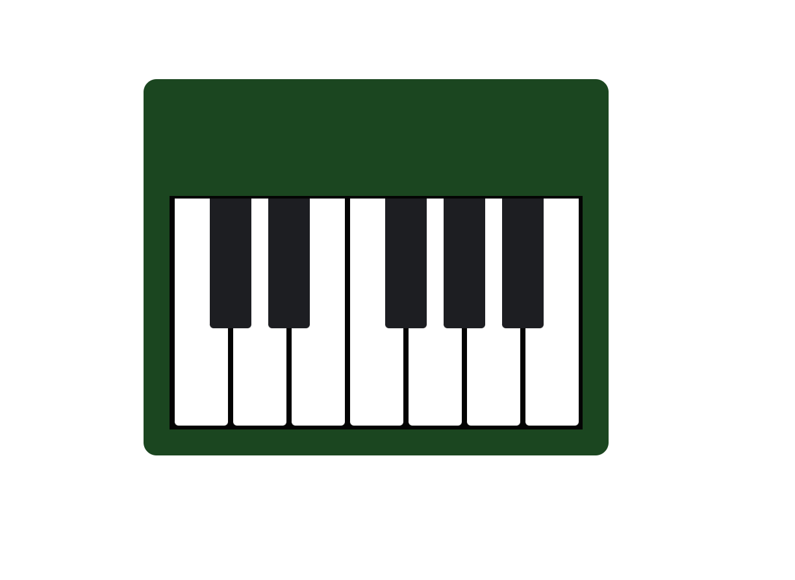

📸Preview

Project Description
This project is a responsive virtual piano layout built using HTML and CSS. It visually represents a piano keyboard with white and black keys, styled to look realistic. The layout adapts to different screen sizes, making it mobile-friendly and desktop-ready.
This project focuses on CSS design techniques like pseudo-elements, flexbox, and media queries, and serves as a foundation for adding interactive features in the future, such as key press animations or sound playback.
Technologies used:
HTML5
CSS3 (including pseudo-elements and media queries)
Features
Realistic piano key layout with white and black keys
Responsive design for desktop, tablet, and mobile screens
Styled with rounded edges and padding for a polished appearance
Lightweight and easy to extend with JavaScript
